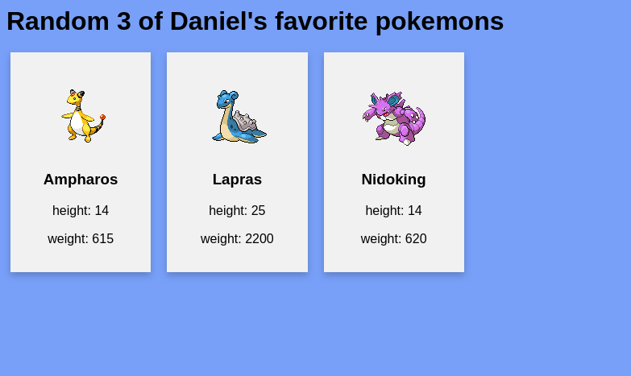

# Favorite pokemons
A small webapp which shows some of my favorite pokemons and their attributes randomized.
Built with FastApi server, asyncio, sqlite and serverside Jinja template rendering.

## Run in virtual env
Used python version 3.10.5
```
$ python3 -m virtualenv venv
$ source venv/bin/activate
$ pip install -r requirements.txt
$ ./entrypoint.sh
```

## Run in Docker

1. Build the image: `docker-compose build` or `docker build -t pokemon-app .`
2. Run with `docker run --rm -it -p 8000:8000 pokemon-app` or `docker-compose up -d` (shut down with `docker-compose down`)

## Preview

